## Fuentes de Información

Una fuente de información se define como una tupla $(\mathcal{S},P)$ donde

- $\mathcal{S}$ es un conjunto de símbolos que pueden ser emitidos por la fuente (un alfabeto).
- $P$ es una distribución de probabilidades asociada (a la emisión) de lo los símbolos.

Las fuentes de información pueden ser contínuas (con un número de mensajes no numerable) o discretas (con un número de mensajes numerable o finito). En este curso nos centraremos en el caso discreto, por ende $S$ será un conjunto finito.

Claramente, $\forall s\in\mathcal{S}, 0\leq P(s)\leq 1$, y $\sum_{s \in\mathcal{S}} P(s) = 1$ (debido a los Axiomas de Kolmogorov).

### Fuentes de Información de Memoria Nula

En una fuente de información de memoria nula, la emisión de cada símbolo $s_i$ es independiente de los símbolos emitidos anteriormente. En este caso, la probabilidad de emitir un símbolo $s_i$ es constante e igual a $P(s_i)$.

La entropía de una fuente de información de memoria nula se define como

$$
H(\mathcal{S}) = -\sum_{s\in\mathcal{S}} P(s)\log\left(P(s)\right)
$$

### Extensión de grado $m$

Podemos imaginarnos la fuente de información de memoria nula como una máquina que emite secuencias de $x$ símbolos, palabras, $x\in\mathcal{S}^+$, de modo que los símbolos sucesivamente emitidos se eligen de acuerdo con las probabilidades $P(s)$.

Sea entonces $|x|=m$, definimos la extensión de grado $m$ de la fuente de información de memoria nula como el par $\left(\mathcal{S}^m, P^m\right)$, donde 

$$
\forall x\in\mathcal{S}^m:P(x)=\prod_{1\leq i\leq m}P(x[i])
$$

Y trivialmente, la entropía 

$$
\begin{align*}
H\left(\mathcal{S}^m\right)&=-\sum_{x\in\mathcal{S}^m}P(x)\log\left(P(x)\right)\\
&=-\sum_{x\in\mathcal{S}^m}\left(\prod_{1\leq i\leq m}P(x[i])\right)\log\left(P(\prod_{1\leq i\leq m}P(x[i]))\right)
\end{align*}
$$

En lugar de calcular los productos de probabilidades de los símbolos para cada una de las palabras de la extensión de grado $m$, se puede demostrar el siguiente útil resultado:

$$
H\left(\mathcal{S}^m\right)=mH(\mathcal{S})
$$

### Fuentes de Markov (fuente de información con memoria, de orden $m$)

En una fuente de Markov, la emisión de cada símbolo $s_i$ depende de los $m$ símbolos emitidos anteriormente (en muchas aplicaciones). En este caso, la probabilidad de emitir un símbolo $s_i$ depende de los $m$ símbolos anteriores, y se denota como la probabilidad condicional $P(s_i|s_{i-1},\ldots,s_{i-m})$, con

$$
\sum_{i=1}^{m}P(s_i|s_{i_1},\ldots,s_{i_m})= 1,\quad i_k = 1,2,\dots,n
$$

A la secuencia de símbolos emitidos se les llama **cadena de Markov**. Los estados de una fuente de Markov (de orden $m$) serán todas las posibles combinaciones de $m$ símbolos $n^m$.

Dada una fuente de Markov de orden $m$, se puede establecer su diagrama de estados que muestra los estados y las probabilidades entre ellos.

---

#### Ejemplos

A partir de un alfabeto binario $\left\{0,1\right\}$, se puede definir una fuente de Markov de orden 2 con los siguientes estados y probabilidades condicionales:

- $P(0|00)=P(1|11)=0.7$
- $P(1|00)=P(0|11)=0.3$
- $P(0|01)=P(1|10)=P(0|10)=P(1|01)=0.5$

El diagrama de estados es el siguiente:

---

Se dice que una fuente de Markov es ergódica si es posible pasar de cualquier estado a cualquier otro estado en un número finito de pasos.

---

#### Ejemplo

Una fuente ergódica podría ser la anterior (podemos alcanzar cualquier estado en un número finito de pasos a partir de otro estado).

Ejemplo de diagrama de estados de una fuente ergódica:

Nótese que el nodo interior es un estado absorbente. Es decir, una vez que se llega a ese estado, no se puede salir de él.

---

Una fuente de Markov es homogénea si las probabilidades condicionales no cambian con el tiempo.

Se dice que una fuente está en estado estacionario si la probabilidad de observación de sus estados no cambia con el tiempo. Las probabilidades se pueden obtener mediante la ecuación $v=\pi\Pi$, donde $\pi$ es el vector de probabilidad de los estados y $\Pi$ es la matriz de transición.

---

#### Ejemplo

Volviendo al ejemplo inicial, la matriz de probabilidades tiene la siguiente forma:

$$
\Pi = \begin{matrix}
& \begin{matrix} 00 & 01 & 10 & 11 \end{matrix} \\
\begin{matrix} 00 \\ 01 \\ 10 \\ 11 \end{matrix} & \begin{pmatrix} 0.7 & 0.5 & 0.5 & 0.3 \\ 0.5 & 0.5 & 0.5 & 0.5 \\ 0.5 & 0.5 & 0.5 & 0.5 \\ 0.3 & 0.5 & 0.5 & 0.7 \end{pmatrix}
\end{matrix}
$$

Véase que cada fila suma 1 (debido a los axiomas de Kolmogorov). Si cada columna sumase 1, entonces la matriz es doblemente estocástica y todos los estados son equiprobables.

Vayamos al cálculo de probabilidades de estados en régimen estacionario. Para ello, nos definimos las siguientes ecuaciones:

$$
\begin{align*}
&P(00) = P(0|00)\cdot P(00) + P(0|10)\cdot P(10)\\
&P(01) = P(1|00)\cdot P(00) + P(0|10)\cdot P(10)\\
&P(11) = P(1|01)\cdot P(01) + P(1|11)\cdot P(11)\\
&P(00) + P(01) + P(10) + P(11) = 1
\end{align*}
$$

Nótese que la última ecuación surge por uno de los axiomas de Kolmogorov, ya que si incluyésemos el estado $01$ en la primera ecuación, tendríamos una ecuación redundante (y por ende un sistema singular; con infinitas soluciones). Conocemos las probabilidades condicionaes, por lo que podemos resolver el sistema de ecuaciones:

$$
\begin{align*}
&P(00) = 0.7\cdot P(00) + 0.5\cdot P(10)\\
&P(01) = 0.3\cdot P(00) + 0.5\cdot P(10)\\
&P(11) = 0.5\cdot P(01) + 0.7\cdot P(11)\\
&P(00) + P(01) + P(10) + P(11) = 1
\end{align*}
$$

Este sistema tiene la siguiente solución:

$$
\pi = \begin{pmatrix} P(00) \\ P(01) \\ P(10) \\ P(11) \end{pmatrix} = \begin{pmatrix} \frac{5}{16} \\ \frac{3}{16} \\ \frac{3}{16} \\ \frac{5}{16} \end{pmatrix}
$$

Ahora, con esta información podemos calcular las probabilidades de aparición de cada símbolo:

$$
\begin{align*}
&P(0) = P(00) + P(10) = \frac{5}{16} + \frac{3}{16} = \frac{8}{16} = \frac{1}{2}\\
&P(1) = P(01) + P(11) = \frac{3}{16} + \frac{5}{16} = \frac{8}{16} = \frac{1}{2}
\end{align*}
$$

---

### Fuentes afines (adjuntas) de una fuente de Markov

Dada una fuente de Markov de orden $m$ con un alfabeto $\mathcal{S}$ y una distribución de probabilidad $P$, denominaremos a la fuente afín como a la fuente de memoria nula $(\mathcal{S},P)$. Es decir, la fuente afín es la fuente de memoria nula que emite los mismos símbolos que la fuente de Markov.

---

#### Ejemplo

Para el ejemplo de la fuente de Markov de orden 2, la fuente afín sería la fuente de memoria nula con $\mathcal{S}=\left\{0,1\right\}$ y $P=\left\{\frac{1}{2},\frac{1}{2}\right\}$.

---

Para el cálculo de entropía de una fuente de Markov de orden $m$, sobre un alfabeto $\mathcal{S}=\left\{s_1,s_2,\dots,s_n\right\}$ y distribución de probabilidad condicional $P(s_i|s_{i_1},\dots,s_{i_m})$, se cumple que $p(s_i, s_{i_1},\dots,s_{i_m}) = p(s_i|s_{i_1},\dots,s_{i_m})\cdot p(s_{i_1},\dots,s_{i_m})$, lo cual nos permite calcular la entropía condicional:

$$
H(\mathcal{S}|s_{i_1},\dots,s_{i_m}) = -\sum_{i=1}^{n}p(s_i|s_{i_1},\dots,s_{i_m})\log\left(p(s_i|s_{i_1},\dots,s_{i_m})\right)
$$

Por lo tanto, la entropía de la fuente de Markov de orden $m$ es:

$$
\begin{align*}
H(\mathcal{S}) &= \sum_{\mathcal{S}^m}p(s_{i_1},\dots,s_{i_m})H(\mathcal{S}|s_{i_1},\dots,s_{i_m})\\
&= -\sum_{\mathcal{S}^m}p(s_{i_1},\dots,s_{i_m})\left(-\sum_{s_i\in\mathcal{S}}p(s_i|s_{i_1},\dots,s_{i_m})\log\left(p(s_i|s_{i_1},\dots,s_{i_m})\right)\right)\\
&= -\sum_{\mathcal{S}^{m+1}}p(s_i, s_{i_1},\dots,s_{i_m})p(s_i|s_{i_1},\dots,s_{i_m})\log\left(p(s_i|s_{i_1},\dots,s_{i_m})\right)\\
&= -\sum_{\mathcal{S}^{m+1}}p(s_{i_1},\dots,s_{i_m},s_i)\log\left(p(s_i|s_{i_1},\dots,s_{i_m})\right)\\
\end{align*}
$$