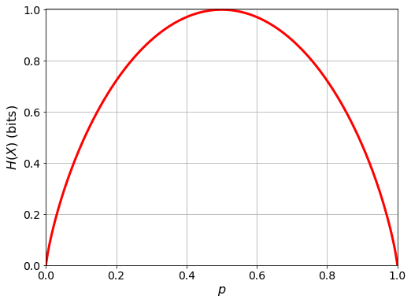

## Entropy

### Preliminaries

#### Random Variable

A random variable is a function that assigns a numerical value to each outcome of a random experiment. For example, if we roll a die, the random variable $X$ that represents the number appearing on the top face of the die can take the values $1, 2, 3, 4, 5, 6$. In this case, we would write that:

$$
X = \\{1,2,3,4,5,6\\}
$$

That is, $X$ is a random variable that takes values in the set $\\{1,2,3,4,5,6\\}$.

In the previous example, the random variable $X$ is discrete, because it takes values in a finite or countable set (remember, there are infinities larger than others. A countable infinity is one that can be matched with the natural numbers $\mathbb{N}$). But there are also continuous random variables, which take values in an interval of real numbers. For example, if we measure a person's height, the random variable representing the height can take any value in the interval $(0,\infty)$.

#### Probability Function

The probability function of a random variable is a function that assigns to each value of the random variable the probability that this value occurs. For example, if we roll a die, the probability function of the random variable $X$ that represents the number appearing on the top face of the die is a function that assigns to each number in the set $\\{1,2,3,4,5,6\\}$ the probability of that number coming up. In this case, the probability function is uniform because all the numbers have the same probability of appearing.

For a discrete random variable, the probability function can be represented in a table or with a formula. For example, if we roll a die, the probability function of the random variable $X$ that represents the number appearing on the top face of the die can be represented with the following table:

| $x$ | $P(X=x)$ |
|-----|----------|
| 1   | 1/6      |
| 2   | 1/6      |
| 3   | 1/6      |
| 4   | 1/6      |
| 5   | 1/6      |
| 6   | 1/6      |

Or with the following formula:

$$
P(X=x) = \frac{1}{6} \quad \text{for } x \in \\{1,2,3,4,5,6\\}
$$

For a continuous random variable, the probability function can be represented by a probability density function. For example, if we measure a person's height, the probability density function of the random variable representing height assigns to each value in the interval $(0,\infty)$ the probability that a person's height falls within that interval.

#### Expected Value

The expected value of a random variable is the average value the random variable takes in a random experiment. It is calculated by multiplying each value of the random variable by its probability and summing the results:

$$
\mathbb{E}[X] = \sum_{i=0}^n x_i \cdot P(X=x_i)
$$

For example, if we roll a die, the expected value of the random variable $X$ representing the number that appears on the top face of the die is calculated as:

$$
\mathbb{E}[X] = 1 \cdot \frac{1}{6} + 2 \cdot \frac{1}{6} + 3 \cdot \frac{1}{6} + 4 \cdot \frac{1}{6} + 5 \cdot \frac{1}{6} + 6 \cdot \frac{1}{6} = 3.5
$$

That is, on average, the number that appears on the top face of the die is 3.5.

For a continuous random variable, the expected value is calculated similarly, but instead of summing the values, we integrate:

$$
\mathbb{E}[X] = \int_{-\infty}^{\infty} xf(x)dx
$$

Where $f(x)$ is the probability density function of the random variable $X$.

#### LOTUS: _Law of the Unconscious Statistician_

LOTUS is a rule that allows us to calculate the expected value of a function of a random variable without needing to know the probability function of the random variable. LOTUS states that the expected value of a function of a random variable is calculated by multiplying the function by the probability function of the random variable and summing the results:

$$
\mathbb{E}[g(X)] = \sum_{i=0}^n g(x_i) \cdot P(X=x_i)
$$

For example, if we roll a die, and define the random variable $Y = X^2$, where $X$ is the random variable representing the number on the top face of the die, the expected value of the random variable $Y$ is calculated as:

$$
\mathbb{E}[Y] = 1^2 \cdot \frac{1}{6} + 2^2 \cdot \frac{1}{6} + 3^2 \cdot \frac{1}{6} + 4^2 \cdot \frac{1}{6} + 5^2 \cdot \frac{1}{6} + 6^2 \cdot \frac{1}{6} = 15.1667
$$

That is, on average, the square of the number on the top face of the die is 15.1667.

For a continuous random variable, LOTUS is calculated similarly, but instead of summing the values, we integrate:

$$
\mathbb{E}[g(X)] = \int_{-\infty}^{\infty} g(x)f(x)dx
$$

Where $f(x)$ is the probability density function of the random variable $X$.

### Entropy

In physics, entropy is a measure of the amount of disorder or chaos in a system; more specifically, in thermodynamics, entropy is a measure of the amount of energy that cannot be used to do work. In information theory, entropy is a measure of the uncertainty of a random variable. It can also be interpreted as a measure of the amount of information needed to describe a random variable.

The entropy of a random variable $X$ is defined as the expected value of the information of the random variable. The information of a random variable is a measure of the "_surprise_" that a value of the random variable produces.

The information of a random variable is calculated as the negative logarithm of the probability of a value of the random variable occurring:

$$
I(x) = -\log_n\left(P(X=x)\right)
$$

Note that the base of the logarithm determines the unit of measurement for the information. This base can be any positive number, but the most common bases are:

- `2`: in which case the unit of information is the _bit_ (binary digit).
- `e`: in which case the unit of information is the _nat_ (natural unit of information).
- `10`: in which case the unit of information is the _hartley_.

**If no base is specified, we will assume the base of the logarithm is 2.**

Knowing this, the entropy of a random variable $X$, which we denote as $H_k(X)$, is calculated as follows (thanks to the LOTUS theorem):

$$
H_k(X) = \mathbb{E}[I(X)] = \sum_{i=0}^n -\log_k\left(P(X=x_i)\right) \cdot P(X=x_i)
$$

Or for a continuous random variable:

$$
H_k(X) = \int_{-\infty}^{\infty} -\log_k\left(f(x)\right) \cdot f(x)dx
$$

where the subscript $k$ indicates the base of the logarithm. **Remember that if no base is specified, we assume the base of the logarithm is 2.**

In information theory, we start with an information source defined as a pair $(S,P)$ where $S$ is a predefined alphabet and $P$ is a probability distribution over $S$.

Since the information source introduces uncertainty in the random variable defined by the predefined alphabet, entropy is useful for measuring the degree of uncertainty, the degree of randomness in the information source, and consequently estimate the average units of information needed to encode all possible values that may occur in the information source.

Due to the properties of the logarithm, $H_k(X)$ has the following alternative (but equivalent) definitions:

- $H_k(X) = -\sum_{i=0}^n \log_k\left(P(X=x_i)\right) \cdot P(X=x_i)$
- $H_k(X) = \sum_{i=0}^n \log_k\left(\frac{1}{P(X=x_i)}\right) P(X=x_i)$

Furthermore, due to the properties of the logarithm (specifically that $\log_a(b) = \frac{\log_c(b)}{\log_c(a)}$), it holds that $H_b(X) = \log_b(a) \cdot H_a(X)$. The proof is straightforward:

$$
\begin{align*}
H_b(X) &= \sum_{i=0}^n -\log_b\left(P(X=x_i)\right) \cdot P(X=x_i) \\
&= \sum_{i=0}^n -\frac{\log_a\left(P(X=x_i)\right)}{\log_a(b)} \cdot P(X=x_i) \\
&= \frac{1}{\log_a(b)}\sum_{i=0}^n -\log_a\left(P(X=x_i)\right) \cdot P(X=x_i) \\
&= \left(\frac{1}{\log_a(b)}\right)H_a(X) \\
&= \left(\frac{1}{\frac{\log_b(b)}{\log_b(a)}}\right)H_a(X) \\
&= \left(\frac{1}{\frac{1}{\log_b(a)}}\right)H_a(X) \\
&= \log_b(a) \cdot H_a(X) \\
\end{align*}
$$

----

#### Example 1: Entropy of a Discrete Random Variable

_Let the alphabet_ $S = \\{a,b,c,d\\}$ _with a probability distribution_ $P = \left\\{\frac{1}{2},\frac{1}{4},\frac{1}{8},\frac{1}{8}\right\\}$. _The entropy of the random variable_ $X$ _defined by the alphabet_ $S$ _and the probability distribution_ $P$ _is:_

$$
H(X) = -\left(\frac{1}{2}\log\left(\frac{1}{2}\right) + \frac{1}{4}\log\left(\frac{1}{4}\right) + \frac{1}{8}\log\left(\frac{1}{8}\right) + \frac{1}{8}\log\left(\frac{1}{8}\right)\right) = 1.75
$$

The entropy of the random variable $X$ is 1.75 bits.

----

An interesting property of entropy is the following: Let $X$ be a random variable over the alphabet $\\{x_1,x_2,\dots,x_n\\}$, then:

$$
0 \leq H(X) \leq \log(n)
$$

The entropy of a random variable $X$ is bounded by $0$ and $\log(n)$, where $n$ is the number of elements in the alphabet of the random variable. Entropy is maximized when the probability distribution is uniform, and minimized when the probability distribution is degenerate (i.e., when a single value of the alphabet has probability 1 and all other values have probability 0).

----

#### Example 2: Entropy of a Bernoulli Distributed Random Variable

_Let_ $X$ _be a Bernoulli distributed random variable with parameter_ $p$ _(i.e.,_ $X \sim \text{Bernoulli}(p)$, _which means that our random variable measures "the number of successes in a Bernoulli experiment"). The probability function of_ $X$ _is:_

$$
P(X=x) = p^x(1-p)^{1-x} \quad \text{for } x \in \{0,1\}
$$

_The entropy of the random variable_ $X$ _is:_

$$
\begin{align*}
H(X) &= -\sum_{x=0}^1 p^x(1-p)^{1-x}\log\left(p^x(1-p)^{1-x}\right) \\
&= -\left(p\log(p) + (1-p)\log(1-p)\right) \\
&= (p-1)\log(1-p) - p\log(p)
\end{align*}
$$

If we represent the entropy of the random variable $X$ as a function of $p$, we obtain the following graph:



_What does this mean?_ The entropy of a Bernoulli random variable is maximized when $p=0.5$, that is, when the probability distribution is uniform. This makes sense because in a uniform distribution, all values of the alphabet have the same probability of occurring, and therefore there is more uncertainty about the value that the random variable will take. On the other hand, the entropy of a Bernoulli random variable is minimized when $p=0$ or $p=1$, that is, when the probability distribution is degenerate. This also makes sense because in a degenerate distribution, only one value of the alphabet has probability 1 and the rest have probability 0, and therefore there is no uncertainty about the value that the random variable will take.

<details>
<summary><em>How would this be programmed in <code>python</code>?</em></summary>

```python
import numpy as np
import matplotlib.pyplot as plt

def H_Bernoulli(p):
    h = (p - 1) * np.log2(1 - p) - p * np.log2(p)
    
    # Fix the NaN values that occur due to the logarithm of zero
    h[np.isnan(h)] = 0

    return h

plt.figure(figsize=(8, 6))

p = np.linspace(0, 1, 200)
plt.plot(p, H_Bernoulli(p), "r", linewidth=3)

plt.grid()
plt.xlim(0, 1)
plt.ylim(0, 1.005)
plt.ylabel(r"$H(X)$ (bits)", fontsize=16)
plt.xlabel(r"$p$", fontsize=16)
plt.tick_params(axis="both", which="major", labelsize=14)
```

</details>

#### Reminder: Joint and Conditional Probabilities

Given two random variables $X$ and $Y$, the joint probability of $X$ and $Y$ is the probability that both random variables take specific values. It is denoted as $P(X=x,Y=y)$, and is calculated as:

$$
P(X=x,Y=y) = P(Y=y|X=x)P(X=x)
$$

where $P(Y=y|X=x)$ is the conditional probability of $Y$ given $X$, i.e., the probability that $Y$ takes a specific value given that $X$ has taken a specific value.

Similarly, we can define the joint probability as:

$$
P(X=x,Y=y) = P(X=x|Y=y)P(Y=y)
$$

Equating both expressions leads to Bayes' Theorem:

$$
P(Y=y|X=x) = \frac{P(X=x|Y=y)P(Y=y)}{P(X=x)}
$$

Additionally, if the random variables $X$ and $Y$ are independent, then the joint probability of $X$ and $Y$ is equal to the product of the marginal probabilities of $X$ and $Y$:

$$
P(X=x,Y=y) = P(X=x)P(Y=y)
$$

Why? Because if $X$ and $Y$ are independent, the probability of $Y$ taking a specific value does not depend on $X$ taking a specific value, and vice versa. Hence, $P(Y=y|X=x) = P(Y=y)$ and $P(X=x|Y=y) = P(X=x)$.

#### Joint Entropy and Conditional Entropy

So far, we have defined the entropy of a single random variable. But in many problems of information theory, we are interested in the entropy of two or more random variables.

The joint entropy of two random variables $X$ and $Y$ is defined as the entropy of the random variable $(X,Y)$, which is a random variable that takes values in the Cartesian product (i.e., all possible pairs) of the alphabets of $X$ and $Y$. The joint entropy of $X$ and $Y$ is denoted as $H(X,Y)$, and is calculated as follows:

$$
H(X,Y) = -\sum_{x\in S_X}\sum_{y\in S_Y} P(X=x,Y=y)\log\left(P(X=x,Y=y)\right)
$$

For continuous random variables:

$$
H(X,Y) = -\int_{-\infty}^{\infty}\int_{-\infty}^{\infty} f(x,y)\log\left(f(x,y)\right)dxdy
$$

Another way to write the joint entropy is by using indices for the values of the random variables:

$$
H(X,Y) = -\sum_{i=0}^n\sum_{j=0}^m P(X=x_i,Y=y_j)\log\left(P(X=x_i,Y=y_j)\right)
$$

In some cases, this notation is clearer than the notation with the alphabets $S_X$ and $S_Y$. Usually $S_X = S_Y$, meaning we are using the same alphabet for both random variables.

Similarly to joint entropy, we can define the conditional entropy of a random variable $X$ given another random variable $Y$. The conditional entropy of $X$ given $Y$ is denoted as $H(X|Y)$, and is calculated as follows:

$$
H(X|Y) = -\sum_{x\in S_X}\sum_{y\in S_Y} P(X=x,Y=y)\log\left(P(X=x|Y=y)\right)
$$

Furthermore, using the properties of joint and conditional probabilities, we can write the conditional entropy of $X$ given $Y$ as:

$$
\begin{align*}
H(X|Y) &= -\sum_{x\in S_X}\sum_{y\in S_Y} P(X=x,Y=y)\log\left(P(X=x|Y=y)\right) \\
&= -\sum_{x\in S_X}\sum_{y\in S_Y} P(X=x|Y=y)P(Y=y)\log\left(P(X=x|Y=y)\right) \\
&= -\sum_{y\in S_Y} P(Y=y)\sum_{x\in S_X} P(X=x|Y=y)\log\left(P(X=x|Y=y)\right) \\
&= \sum_{y\in S_Y} P(Y=y)H(X|Y=y)
\end{align*}
$$

As demonstrated above, the properties of joint entropy arise from working with the joint and conditional probabilities of random variables $X$ and $Y$.

One of these properties is:

$$
H(X,Y) = H(X) + H(Y|X) = H(Y) + H(X|Y)
$$

This property is known as the **chain rule of entropy**, and it can be derived from the definition of joint and conditional entropy:

$$
\begin{align*}
H(X,Y) &= -\sum_{x\in S_X}\sum_{y\in S_Y} P(X=x,Y=y)\log\left(P(X=x,Y=y)\right) \\
&= -\sum_{x\in S_X}\sum_{y\in S_Y} P(X=x,Y=y)\log\left(P(X=x|Y=y)P(Y=y)\right) \\
&= -\sum_{x\in S_X}\sum_{y\in S_Y} P(X=x,Y=y)\left(\log\left(P(X=x|Y=y)\right) + \log\left(P(Y=y)\right)\right) \\
&= -\sum_{x\in S_X}\sum_{y\in S_Y} P(X=x,Y=y)\log\left(P(X=x|Y=y)\right) - \sum_{x\in S_X}\sum_{y\in S_Y} P(X=x,Y=y)\log\left(P(Y=y)\right) \\
&= H(X|Y) - \sum_{y\in S_Y} P(Y=y)\log\left(P(Y=y)\right) \\
&= H(X|Y) + H(Y)
\end{align*}
$$

In the same way, we can prove that $H(X,Y) = H(Y) + H(X|Y)$.

From this result, we can derive the following inequalities for the random variables $X$ and $Y$:

1. $H(X,Y) \leq H(X) + H(Y)$
2. $H(X,Y) = H(X) + H(Y)$ (if $X$ and $Y$ are independent)

_A simple way to think about these properties is to think about joint and conditional probabilities, from which we derive similar inequalities. However, in the case of entropy, due to the logarithm, the inequalities involve sums rather than products._

A corollary of the above properties is:

1. $H(X|Y) \leq H(X)$
2. $H(X|Y) = H(X)$ (if $X$ and $Y$ are independent)

----

Returning to the chain rule, it can be extended to the case of more than two variables, and is defined as:

$$
H(X_1,X_2,\dots,X_n) = H(X_1) + H(X_2|X_1) + H(X_3|X_1,X_2) + \dots + H(X_n|X_1,X_2,\dots,X_{n-1})
$$

or more compactly:

$$
H(X_1,X_2,\dots,X_n) = \sum_{i=1}^n H(X_i|X_1,X_2,\dots,X_{i-1})
$$

#### Relative Entropy

Relative entropy, also known as **Kullback-Leibler divergence**, is a measure of the difference between two probability distributions (the amount of information needed to describe one probability distribution using another). The relative entropy of two probability distributions $P$ and $Q$ is denoted as $D(P||Q)$, and is calculated as:

$$
D(P||Q) = \sum_{x\in S} P(x)\log\left(\frac{P(x)}{Q(x)}\right)
$$

For continuous probability distributions:

$$
D(P||Q) = \int_{-\infty}^{\infty} f(x)\log\left(\frac{f(x)}{g(x)}\right)dx
$$

Relative entropy is always **non-negative**, and is equal to zero if and only if $P$ and $Q$ are equal.

#### Mutual Information

The mutual information of two random variables $X$ and $Y$ is a measure of the amount of information that one random variable provides about the other. The mutual information of $X$ and $Y$ is denoted as $I(X;Y)$, and is calculated as:

$$
I(X;Y) = \sum_{x\in S_X}\sum_{y\in S_Y} P(X=x,Y=y)\log\left(\frac{P(X=x,Y=y)}{P(X=x)P(Y=y)}\right)
$$

For continuous random variables:

$$
I(X;Y) = \int_{-\infty}^{\infty}\int_{-\infty}^{\infty} f(x,y)\log\left(\frac{f(x,y)}{f(x)f(y)}\right)dxdy
$$

Mutual information is always **non-negative**, and it is equal to zero if and only if $X$ and $Y$ are independent. Mutual information can also be thought of as the relative entropy between the joint distribution of two random variables and the product of their marginal distributions.

From the definition of mutual information, the following properties can be deduced:

1. $I(X;Y) = H(X) - H(X|Y) = H(Y) - H(Y|X)$
2. $I(X;Y) = H(X) + H(Y) - H(X,Y)$
3. $I(X;Y) = I(Y;X)$
4. $I(X;X) = H(X)$

Graphically, these properties can be represented as follows:


#### The Continuous Case

#### Example 1: Uniform Distribution

Let the random variable $X$ be uniformly distributed between $0$ and $a$. Its probability density function is:

$$
f(x)=\begin{cases}
\frac{1}{a}\quad\text{if }x\in\left[0,a\right]\\
0\quad\text{otherwise}
\end{cases}
$$

Its entropy is:

$$
\begin{align*}
H(X) &= -\int_{-\infty}^\infty f(x)\log\left(f(x)\right)dx\\
&= -\int_{-\infty}^0 0\log(0)dx - \int_0^a \frac{1}{a}\log\left(\frac{1}{a}\right)dx - \int_0^{\infty} 0\log(0)dx\\
&= \int_0^a \frac{1}{a}\log(a)dx\\
&= \left[\frac{x}{a}\log(a)\right]_0^a\\
&= \log(a)
\end{align*}
$$

#### Example 2: Normal Distribution

Let the random variable $X$ have a probability density function

$$
f(x) = \frac{1}{\sigma\sqrt{2\pi}}e^{\frac{-(x-\mu)^2}{2\sigma^2}}
$$

_(i.e., a normal distribution with mean_ $\mu$ _and variance_ $\sigma^2$ _)_

Its entropy is:

$$
\begin{align*}
H(X) &= -\int_{-\infty}^\infty f(x)\log\left(f(x)\right)dx\\
&= -\int_{-\infty}^\infty \frac{1}{\sigma\sqrt{2\pi}}e^{\frac{-(x-\mu)^2}{2\sigma^2}}\log\left(\frac{1}{\sigma\sqrt{2\pi}}e^{\frac{-(x-\mu)^2}{2\sigma^2}}\right)dx\\
&= -\int_{-\infty}^\infty \frac{1}{\sigma\sqrt{2\pi}}e^{\frac{-(x-\mu)^2}{2\sigma^2}}\left(-\log\left(\sigma\sqrt{2\pi}\right)+\frac{-\log\left(e\right)(x-\mu)^2}{2\sigma^2}\right)dx\\
&= -\left(-\log\left(\sigma\sqrt{2\pi}\right)\int_{-\infty}^\infty \frac{1}{\sigma\sqrt{2\pi}}e^{\frac{-(x-\mu)^2}{2\sigma^2}} + \int_{-\infty}^\infty \frac{-\log\left(e\right)(x-\mu)^2}{2\sigma^3\sqrt{2\pi}}e^{\frac{-(x-\mu)^2}{2\sigma^2}}\right)dx\\
&= -\left(-\log\left(\sigma\sqrt{2\pi}\right)\cdot 1 - \frac{\log\left(e\right)}{2\sigma^2}\int_{-\infty}^\infty \frac{(x-\mu)^2}{\sigma\sqrt{2\pi}}e^{\frac{-(x-\mu)^2}{2\sigma^2}}\right)dx\\
&= \log\left(\sigma\sqrt{2\pi}\right) + \frac{\log\left(e\right)}{2\sigma^2}\left(\sigma^2\right)\\
&= \log\left(\sigma\sqrt{2\pi}\right) + \frac{\log\left(e\right)}{2}\\
&= \log\left(\sigma\sqrt{2\pi}\right) + \log\left(\sqrt{e}\right)\\
&= \log\left(\sigma\sqrt{2\pi e}\right)\\
\end{align*}
$$

# [Language Structure (click to access content)](../3-language-structure/README.md)
