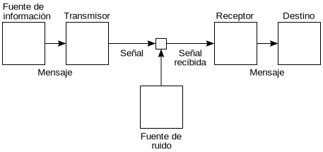

# Information Theory

## Index

1. [Introduction](#introduction)
2. [Entropy](./2-entropy/README.md)
3. [Language Structure](./3-language_structure/README.md)
4. [Information Sources](./4-information_sources/README.md)

## Introduction

Information theory is a branch of mathematics that studies the quantification of information. It was proposed by Claude Shannon in 1948 to study the transmission of messages in communication systems, and since then it has become a fundamental discipline in communication engineering and computer science theory.

Information theory is based on probability theory and communication systems theory. Its goal is to study the amount of information that can be transmitted through a communication channel, and the theoretical and practical limitations that exist for the transmission of information.

### General Scheme of Communication Systems

In general, a communication system consists of the following elements:

- **Information Source**: the origin of the messages to be transmitted. This can be a human, a sensor, a computer, etc...
- **Encoder**: responsible for transforming the messages from the source into a suitable form for transmission through the communication channel.
- **Communication Channel**: the physical medium through which messages are transmitted. This can be a cable, optical fiber, air, etc...
- **Decoder**: responsible for transforming the messages received through the channel into a suitable form for interpretation by the recipient.
- **Recipient**: the receiver of the messages transmitted by the communication system.
- **Noise**: any disturbance that affects the transmission of messages through the communication channel.

Due to the presence of noise in the communication channel, it is not possible to transmit information perfectly. For this reason, it is important to quantify the amount of information that can be transmitted through a communication channel and to study the theoretical and practical limitations that exist for information transmission.

# [Entropy (click to access content)](./2-entropy/README.md)

