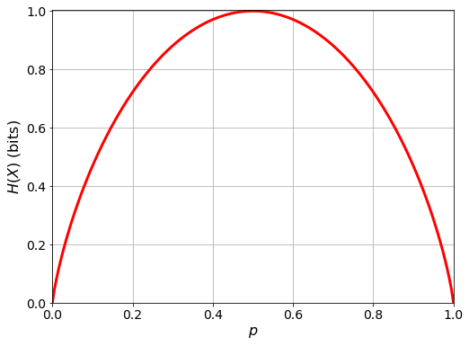
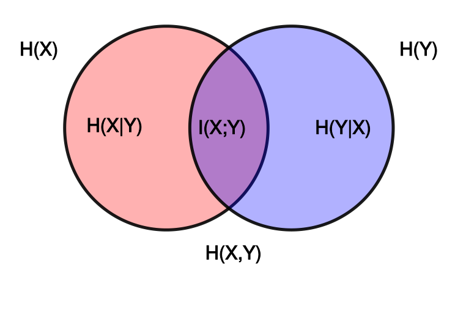

## Entropía

### Preliminares

#### Variable aleatoria

Una variable aleatoria es una función que asigna un valor numérico a cada resultado de un experimento aleatorio. Por ejemplo, si lanzamos un dado, la variable aleatoria $X$ que representa el número que sale en la cara superior del dado, puede tomar los valores $1, 2, 3, 4, 5, 6$. En ese caso escribiríamos que

$$
X = \{1,2,3,4,5,6\}
$$

Osea, $X$ es una variable aleatoria que toma valores en el conjunto $\{1,2,3,4,5,6\}$.

En el ejemplo anterior, la variable aleatoria $X$ es discreta, porque toma valores en un conjunto finito o numerable (recuerda, hay infinitos más grandes que otros. Un infinito numerable es aquel que se puede poner en correspondencia con los números naturales $\mathbb{N}$). Pero también hay variables aleatorias continuas, que toman valores en un intervalo de números reales. Por ejemplo, si medimos la altura de una persona, la variable aleatoria que representa la altura puede tomar cualquier valor en el intervalo $(0,\infty)$.

#### Función de probabilidad

La función de probabilidad de una variable aleatoria es una función que asigna a cada valor de la variable aleatoria la probabilidad de que ese valor ocurra. Por ejemplo, si lanzamos un dado, la función de probabilidad de la variable aleatoria $X$ que representa el número que sale en la cara superior del dado, es una función que asigna a cada número del conjunto $\{1,2,3,4,5,6\}$ la probabilidad de que salga ese número. En este caso, la función de probabilidad es uniforme, porque todos los números tienen la misma probabilidad de salir.

Para una variable aleatoria discreta, la función de probabilidad se puede representar mediante una tabla o mediante una fórmula. Por ejemplo, si lanzamos un dado, la función de probabilidad de la variable aleatoria $X$ que representa el número que sale en la cara superior del dado, se puede representar mediante la siguiente tabla:

| $x$ | $P(X=x)$ |
|-----|----------|
| 1   | 1/6      |
| 2   | 1/6      |
| 3   | 1/6      |
| 4   | 1/6      |
| 5   | 1/6      |
| 6   | 1/6      |

O mediante la siguiente fórmula:

$$
P(X=x) = \frac{1}{6} \quad \text{para } x \in \{1,2,3,4,5,6\}
$$

Para una variable aleatoria continua, la función de probabilidad se puede representar mediante una función de densidad de probabilidad. Por ejemplo, si medimos la altura de una persona, la función de densidad de probabilidad de la variable aleatoria que representa la altura, es una función que asigna a cada valor del intervalo $(0,\infty)$ la probabilidad de que la altura de una persona esté en ese intervalo.

#### Esperanza matemática

La esperanza matemática de una variable aleatoria es el valor promedio que toma la variable aleatoria en un experimento aleatorio. Se calcula multiplicando cada valor de la variable aleatoria por su probabilidad, y sumando los resultados:

$$
\mathbb{E}[X] = \sum_{i=0}^n x_i \cdot P(X=x_i)
$$


Por ejemplo, si lanzamos un dado, la esperanza matemática de la variable aleatoria $X$ que representa el número que sale en la cara superior del dado, se calcula como

$$
\mathbb{E}[X] = 1 \cdot \frac{1}{6} + 2 \cdot \frac{1}{6} + 3 \cdot \frac{1}{6} + 4 \cdot \frac{1}{6} + 5 \cdot \frac{1}{6} + 6 \cdot \frac{1}{6} = 3.5
$$

Osea, en promedio, el número que sale en la cara superior del dado es 3.5.

Para una variable aleatoria continua, la esperanza matemática se calcula de forma similar, pero en lugar de sumar los valores de la variable aleatoria, se integran:

$$
\mathbb{E}[X] = \int_{-\infty}^{\infty} xf(x)dx
$$

Donde $f(x)$ es la función de densidad de probabilidad de la variable aleatoria $X$.

#### LOTUS: _Law of the Unconscious Statistician_ (Ley del Estadístico Inconsciente)

La LOTUS es una regla que permite calcular la esperanza matemática de una función de una variable aleatoria, sin necesidad de conocer la función de probabilidad de la variable aleatoria. La LOTUS establece que la esperanza matemática de una función de una variable aleatoria se calcula multiplicando la función por la función de probabilidad de la variable aleatoria, y sumando los resultados:

$$
\mathbb{E}[g(X)] = \sum_{i=0}^n g(x_i) \cdot P(X=x_i)
$$

Por ejemplo, si lanzamos un dado, y definimos la variable aleatoria $Y = X^2$, donde $X$ es la variable aleatoria que representa el número que sale en la cara superior del dado, la esperanza matemática de la variable aleatoria $Y$ se calcula como

$$
\mathbb{E}[Y] = 1^2 \cdot \frac{1}{6} + 2^2 \cdot \frac{1}{6} + 3^2 \cdot \frac{1}{6} + 4^2 \cdot \frac{1}{6} + 5^2 \cdot \frac{1}{6} + 6^2 \cdot \frac{1}{6} = 15.1667
$$

Osea, en promedio, el cuadrado del número que sale en la cara superior del dado es 15.1667.

Para una variable aleatoria continua, la LOTUS se calcula de forma similar, pero en lugar de sumar los valores de la variable aleatoria, se integran:

$$
\mathbb{E}[g(X)] = \int_{-\infty}^{\infty} g(x)f(x)dx
$$

Donde $f(x)$ es la función de densidad de probabilidad de la variable aleatoria $X$.

### Entropía

En física, la entropía es una medida de la cantidad de desorden o caos en un sistema; más concretamente en termodinámica, la entropía es una medida de la cantidad de energía que no se puede utilizar para realizar trabajo. En teoría de la información, la entropía es una medida de la incertidumbre de una variable aleatoria. También se puede interpretar como una medida de la cantidad de información que se necesita para describir una variable aleatoria.

La entropía de una variable aleatoria $X$ se define como la esperanza matemática de la información de la variable aleatoria. La información de una variable aleatoria es una medida de la "_sorpresa_" que produce un valor de la variable aleatoria.

La información de una variable aleatoria se calcula como el negativo del logaritmo de la probabilidad de que ocurra un valor de la variable aleatoria:

$$
I(x) = -\log_n\left(P(X=x)\right)
$$

Nótese que la base del logaritmo determina la unidad de medida de la información. Esta base puede ser cualquier número positivo, pero las bases más comunes son:

- `2`: en cuyo caso la unidad de medida de la información es el _bit_ (binary digit).
- `e`: en cuyo caso la unidad de medida de la información es el _nat_ (natural unit of information).
- `10`: en cuyo caso la unidad de medida de la información es el _hartley_.

**En caso de no especificar ninguna base, asumiremos que la base del logaritmo es 2.**

Sabiendo esto, la entropía de una variable aleatoria $X$, que denotaremos como $H_k(X)$, se calcula de la siguiente manera (gracias al teorema LOTUS):

$$
H_k(X) = \mathbb{E}[I(X)] = \sum_{i=0}^n -\log_k\left(P(X=x_i)\right) \cdot P(X=x_i)
$$

O para una variable aleatoria continua:

$$
H_k(X) = \int_{-\infty}^{\infty} -\log_k\left(f(x)\right) \cdot f(x)dx
$$

donde el subíndice $k$ indica la base del logaritmo. **Recordad que si no se especifica ninguna base, asumiremos que la base del logaritmo es 2.**

En teoría de la información, partiremos de una fuente de información definida como un par $(S,P)$ donde $S$ es un alfabeto predefinido y $P$ es una distribución de probabilidad sobre $S$.

Dado que la fuente de información introduce una incertidumbre en la variable aleatoria definida por el alfabeto predefinido, la entropía nos será de utilidad para medir el grado de incertidumbre, el grado de aleatoriedad en la fuente de información y, en consecuencia, estimar las unidades de información necesarias en promedio para codificar todos los valores posibles que puedan darse en la fuente de información.

Debido a las propiedades del logaritmo, $H_k(X)$ admite las siguientes definiciones alternativas (pero equivalentes):

- $H_k(X) = -\sum_{i=0}^n\log_k\left(P(X=x_i)\right)\cdot P(X=x_i) $
- $H_k(X) = \sum_{i=0}^n \log_k\left(\frac{1}{P(X=x_i)}\right)P(X=x_i)$

Además, debido a las propiedades del logaritmo (en particular que $\log_a(b)=\frac{\log_c(b)}{\log_c(a)}$), se cumple que $H_b(X)=\log_b(a)\cdot H_a(X)$. La demostración es sencilla:

$$
\begin{align*}
H_b(X) &= \sum_{i=0}^n -\log_b\left(P(X=x_i)\right) \cdot P(X=x_i) \\
&= \sum_{i=0}^n -\frac{\log_a\left(P(X=x_i)\right)}{\log_a(b)} \cdot P(X=x_i) \\
&= \frac{1}{\log_a(b)}\sum_{i=0}^n -\log_a\left(P(X=x_i)\right) \cdot P(X=x_i) \\
&= \left(\frac{1}{\log_a(b)}\right)H_a(X) \\
&= \left(\frac{1}{\frac{\log_b(b)}{\log_b(a)}}\right)H_a(X) \\
&= \left(\frac{1}{\frac{1}{\log_b(a)}}\right)H_a(X) \\
&= \log_b(a)\cdot H_a(X) \\
\end{align*}
$$

----

#### Ejemplo 1: Entropía de una variable aleatoria discreta

_Sea el alfabeto $S=\left\{a,b,c,d\right\}$ con una distribución de probabilidades $P=\left\{\frac{1}{2},\frac{1}{4},\frac{1}{8},\frac{1}{8}\right\}$. La entropía de la variable aleatoria $X$ definida por el alfabeto $S$ y la distribución de probabilidad $P$ es:_

$$
H(X) = -\left(\frac{1}{2}\log\left(\frac{1}{2}\right) + \frac{1}{4}\log\left(\frac{1}{4}\right) + \frac{1}{8}\log\left(\frac{1}{8}\right) + \frac{1}{8}\log\left(\frac{1}{8}\right)\right) = 1.75
$$

La entropia de la variable aleatoria $X$ es 1.75 bits.

----

Una propiedad interesante de la entropía es la siguiente: sea $X$ una variable aleatoria sobre el alfabeto $\left\{x_1,x_2,\dots,x_n\right\}$, entonces:

$$
0 \leq H(X) \leq \log(n)
$$

La entropía de una variable aleatoria $X$ está acotada por $0$ y $\log(n)$, donde $n$ es el número de elementos del alfabeto de la variable aleatoria. La entropía es máxima cuando la distribución de probabilidad es uniforme, y es mínima cuando la distribución de probabilidad es degenerada (es decir, cuando un único valor del alfabeto tiene probabilidad 1 y el resto de valores tienen probabilidad 0).

----

#### Ejemplo 2: Entropía de una variable aleatoria distribuida bernoulli

_Sea $X$ una variable aleatoria distribuida Bernoulli con parámetro $p$ (es decir, $X\sim\text{Bernoulli}(p)$, lo cual quiere decir que nuestra variable aleatoria mide "el número de éxitos en un experimento de Bernoulli"). La función de probabilidad de $X$ es:_

$$
P(X=x) = p^x(1-p)^{1-x} \quad \text{para } x\in\{0,1\}
$$

_La entropía de la variable aleatoria $X$ es:_

$$
\begin{align*}
H(X) &= -\sum_{x=0}^1 p^x(1-p)^{1-x}\log\left(p^x(1-p)^{1-x}\right) \\
&= -\left(p\log(p) + (1-p)\log(1-p)\right) \\
&= (p-1)\log(1-p) -p\log(p)
\end{align*}
$$

Si representamos la entropía de la variable aleatoria $X$ en función de $p$, obtenemos la siguiente gráfica:



_¿Qué interpretación tiene esto?_ La entropía de una variable aleatoria Bernoulli es máxima cuando $p=0.5$, es decir, cuando la distribución de probabilidad es uniforme. Esto tiene sentido, porque en una distribución uniforme, todos los valores del alfabeto tienen la misma probabilidad de ocurrir, y por lo tanto hay más incertidumbre sobre el valor que tomará la variable aleatoria. Por otro lado, la entropía de una variable aleatoria Bernoulli es mínima cuando $p=0$ o $p=1$, es decir, cuando la distribución de probabilidad es degenerada. Esto también tiene sentido, porque en una distribución degenerada, solo un valor del alfabeto tiene probabilidad 1 y el resto de valores tienen probabilidad 0, y por lo tanto no hay incertidumbre sobre el valor que tomará la variable aleatoria.

_¿Cómo se programaría esto en `python`?_

```python
import numpy as np
import matplotlib.pyplot as plt

def H_Bernoulli(p):

    h = (p - 1)*np.log2(1 - p) - p*np.log2(p)
    
    # Fix the NaN values that occur due to the logarithm of zero
    h[np.isnan(h)] = 0

    return h

plt.figure(figsize=(8, 6))

p = np.linspace(0, 1, 200)
plt.plot(p, H_Bernoulli(p), "r", linewidth=3)

plt.grid()
plt.xlim(0, 1)
plt.ylim(0, 1.005)
plt.ylabel(r"$H(X)$ (bits)", fontsize=16)
plt.xlabel(r"$p$", fontsize=16)
plt.tick_params(axis="both", which="major", labelsize=14)
```

#### Recordatorio: probabilidades conjuntas y condicionales

Dadas dos variables aleatorias $X$ e $Y$, la probabilidad conjunta de $X$ e $Y$ es la probabilidad de que ambas variables aleatorias tomen un valor determinado. Se denota como $P(X=x,Y=y)$, y se calcula de la siguiente manera:

$$
P(X=x,Y=y) = P(Y=y|X=x)P(X=x)
$$

donde $P(Y=y|X=x)$ es la probabilidad condicional de $Y$ dado $X$, es decir, la probabilidad de que $Y$ tome un valor determinado dado que $X$ ha tomado un valor determinado.

De la misma manera, podemos definir la probabilidad conjunta como

$$
P(X=x,Y=y) = P(X=x|Y=y)P(Y=y)
$$

Igualando ambas expresiones, se obtiene el Teorema de Bayes:

$$
P(Y=y|X=x) = \frac{P(X=x|Y=y)P(Y=y)}{P(X=x)}
$$

Además, si las variables aleatorias $X$ e $Y$ son independientes, entonces la probabilidad conjunta de $X$ e $Y$ es igual al producto de las probabilidades marginales de $X$ e $Y$:

$$
P(X=x,Y=y) = P(X=x)P(Y=y)
$$

¿Por qué? Porque si $X$ e $Y$ son independientes, entonces la probabilidad de que $Y$ tome un valor determinado no depende de que $X$ haya tomado un valor determinado, y viceversa, por ende $P(Y=y|X=x) = P(Y=y)$ y $P(X=x|Y=y) = P(X=x)$.

#### Entropía conjunta y entropía condicional

Hasta ahora hemos definido la entropía de una única variable aleatoria. Pero en muchos problemas de teoría de la información, estamos interesados en la entropía de dos o más variables aleatorias.

La entropía conjunta de dos variables aleatorias $X$ e $Y$ se define como la entropía de la variable aleatoria $(X,Y)$, que es una variable aleatoria que toma valores en el producto cartesiano (es decir, todas las parejas posibles) de los alfabetos de $X$ e $Y$. La entropía conjunta de $X$ e $Y$ se denota como $H(X,Y)$, y se calcula de la siguiente manera:

$$
H(X,Y) = -\sum_{x\in S_X}\sum_{y\in S_Y} P(X=x,Y=y)\log\left(P(X=x,Y=y)\right)
$$

O para variables aleatorias continuas:

$$
H(X,Y) = -\int_{-\infty}^{\infty}\int_{-\infty}^{\infty} f(x,y)\log\left(f(x,y)\right)dxdy
$$

Otra manera de escribir la entropía conjunta sería utilizando índices para los valores de las variables aleatorias:

$$
H(X,Y) = -\sum_{i=0}^n\sum_{j=0}^m P(X=x_i,Y=y_j)\log\left(P(X=x_i,Y=y_j)\right)
$$

En algunos casos, esta notación es más clara que la notación con los alfabetos $S_X$ y $S_Y$. Habitualmente $S_X = S_Y$, es decir, estamos usando el mismo alfabeto para ambas variables aleatorias.

De forma similar a la entropía conjunta, podemos definir la entropía condicional de una variable aleatoria $X$ dada otra variable aleatoria $Y$. La entropía condicional de $X$ dado $Y$ se denota como $H(X|Y)$, y se calcula de la siguiente manera:

$$
H(X|Y) = -\sum_{x\in S_X}\sum_{y\in S_Y} P(X=x,Y=y)\log\left(P(X=x|Y=y)\right)
$$

Es más, utilizando las propiedades de las probabilidades conjuntas y condicionales, podemos escribir la entropía condicional de $X$ dado $Y$ de la siguiente manera:

$$
\begin{align*}
H(X|Y) &= -\sum_{x\in S_X}\sum_{y\in S_Y} P(X=x,Y=y)\log\left(P(X=x|Y=y)\right) \\
&= -\sum_{x\in S_X}\sum_{y\in S_Y} P(X=x|Y=y)P(Y=y)\log\left(P(X=x|Y=y)\right) \\
&= -\sum_{y\in S_Y} P(Y=y)\sum_{x\in S_X} P(X=x|Y=y)\log\left(P(X=x|Y=y)\right) \\
&= \sum_{y\in S_Y} P(Y=y)H(X|Y=y)
\end{align*}
$$

De la misma manera que hemos hecho en la demostración anterior, las propiedades de la entropia conjunta se originan de operar con las probabilidades conjuntas y condicionales de las variables aleatorias $X$ e $Y$.

Una de estas propiedades es


$$
H(X,Y) = H(X) + H(Y|X) = H(Y) + H(X|Y)
$$

Esta propiedad se conoce como la regla de la cadena de la entropía, y se puede demostrar a partir de la definición de la entropía conjunta y condicional:

$$
\begin{align*}
H(X,Y) &= -\sum_{x\in S_X}\sum_{y\in S_Y} P(X=x,Y=y)\log\left(P(X=x,Y=y)\right) \\
&= -\sum_{x\in S_X}\sum_{y\in S_Y} P(X=x,Y=y)\log\left(P(X=x|Y=y)P(Y=y)\right) \\
&= -\sum_{x\in S_X}\sum_{y\in S_Y} P(X=x,Y=y)\left(\log\left(P(X=x|Y=y)\right) + \log\left(P(Y=y)\right)\right) \\
&= -\sum_{x\in S_X}\sum_{y\in S_Y} P(X=x,Y=y)\log\left(P(X=x|Y=y)\right) - \sum_{x\in S_X}\sum_{y\in S_Y} P(X=x,Y=y)\log\left(P(Y=y)\right) \\
&= H(X|Y) - \sum_{y\in S_Y} P(Y=y)\log\left(P(Y=y)\right) \\
&= H(X|Y) + H(Y)
\end{align*}
$$

De la misma manera, se puede demostrar que $H(X,Y) = H(Y) + H(X|Y)$.

De este resultado se puede demostrar que dadas las variables aleatorias $X$ e $Y$:

1. $H(X,Y) \leq H(X) + H(Y)$
2. $H(X,Y) = H(X) + H(Y)$, (en caso de que $X$ e $Y$ sean independientes)

_Una forma sencilla de pensar sobre estas propiedades es pensar en las probabilidades conjuntas y condicionales, de las cuales obtenemos desigualdades similares, solamente que en el caso de la entropía, debido al logaritmo, las desigualdades no son productos si no sumas._

Un corolario de las propiedades anteriores es que:

1. $H(X|Y) \leq H(X)$
2. $H(X|Y) = H(X)$, (en caso de que $X$ e $Y$ sean independientes)

----

Volviendo a la regla de la cadena, esta la podemos extender para el caso de más de dos variables, y se define como:

$$
H(X_1,X_2,\dots,X_n) = H(X_1) + H(X_2|X_1) + H(X_3|X_1,X_2) + \dots + H(X_n|X_1,X_2,\dots,X_{n-1})
$$

o de forma más compacta:

$$
H(X_1,X_2,\dots,X_n) = \sum_{i=1}^n H(X_i|X_1,X_2,\dots,X_{i-1})
$$

#### Entropía Relativa

La entropía relativa, también conocida como divergencia de Kullback-Leibler, es una medida de la diferencia entre dos distribuciones de probabilidad (la cantidad de información que se necesita para describir una distribución de probabilidad utilizando otra distribución de probabilidad). La entropía relativa de dos distribuciones de probabilidad $P$ y $Q$ se denota como $D(P||Q)$, y se calcula de la siguiente manera:

$$
D(P||Q) = \sum_{x\in S} P(x)\log\left(\frac{P(x)}{Q(x)}\right)
$$

O para distribuciones de probabilidad continuas:

$$
D(P||Q) = \int_{-\infty}^{\infty} f(x)\log\left(\frac{f(x)}{g(x)}\right)dx
$$

La entropía relativa es siempre **no negativa**, y es igual a cero si y solo si $P$ y $Q$ son iguales.

#### Información Mutua

La información mutua de dos variables aleatorias $X$ e $Y$ es una medida de la cantidad de información que una variable aleatoria proporciona sobre la otra variable aleatoria. La información mutua de $X$ e $Y$ se denota como $I(X;Y)$, y se calcula de la siguiente manera:

$$
I(X;Y) = \sum_{x\in S_X}\sum_{y\in S_Y} P(X=x,Y=y)\log\left(\frac{P(X=x,Y=y)}{P(X=x)P(Y=y)}\right)
$$

O para variables aleatorias continuas:

$$
I(X;Y) = \int_{-\infty}^{\infty}\int_{-\infty}^{\infty} f(x,y)\log\left(\frac{f(x,y)}{f(x)f(y)}\right)dxdy
$$

La información mutua es siempre **no negativa**, y es igual a cero si y solo si $X$ e $Y$ son independientes. Se puede pensar también que la información mutua es la entropía relativa entre la distribución conjunta de dos variables aleatorias y el producto de sus distribuciones marginales.

De la definición de la información mutua se pueden deducir las siguientes propiedades:

1. $I(X;Y) = H(X) - H(X|Y) = H(Y) - H(Y|X)$
2. $I(X;Y) = H(X) + H(Y) - H(X,Y)$
3. $I(X;Y) = I(Y;X)$
4. $I(X;X) = H(X)$

Gráficamente, estas propiedades se pueden representar de la siguiente manera:



#### El caso contínuo

#### Ejemplo 1: Distribución uniforme

Sea la variable aleatoria $X$ uniformemente distribuída entre $0$ y $a$. Su función de densidad de probabilidad es

$$
f(x)=\begin{cases}
\frac{1}{a}\quad\text{si }x\in\left[0,a\right]\\
0\quad\text{en caso contrario}
\end{cases}
$$

Su entropía es

$$
\begin{align*}
H(X) &= -\int_{-\infty}^\infty f(x)\log\left(f(x)\right)dx\\
&= -\int_{-\infty}^0 0\log(0)dx - \int_0^a \frac{1}{a}\log\left(\frac{1}{a}\right)dx - \int_0^{\infty} 0\log(0)dx\\
&= \int_0^a \frac{1}{a}\log(a)dx\\
&= \left[\frac{x}{a}\log(a)\right]_0^a\\
&= \log(a)
\end{align*}
$$

#### Ejemplo 2: Distribución normal

Sea la variable aleatoria $X$ con función de densidad de probabilidad

$$
f(x) = \frac{1}{\sigma\sqrt{2\pi}}e^{\frac{-(x-\mu)^2}{2\sigma^2}}
$$

_(es decir una distribución normal con media $\mu$ y varianza $\sigma^2$)_

Su entropía es

$$
\begin{align*}
H(X) &= -\int_{-\infty}^\infty f(x)\log\left(f(x)\right)dx\\
&= -\int_{-\infty}^\infty \frac{1}{\sigma\sqrt{2\pi}}e^{\frac{-(x-\mu)^2}{2\sigma^2}}\log\left(\frac{1}{\sigma\sqrt{2\pi}}e^{\frac{-(x-\mu)^2}{2\sigma^2}}\right)dx\\
&= -\int_{-\infty}^\infty \frac{1}{\sigma\sqrt{2\pi}}e^{\frac{-(x-\mu)^2}{2\sigma^2}}\left(-\log\left(\sigma\sqrt{2\pi}\right)+\frac{-\log\left(e\right)(x-\mu)^2}{2\sigma^2}\right)dx\\
&= -\left(-\log\left(\sigma\sqrt{2\pi}\right)\int_{-\infty}^\infty \frac{1}{\sigma\sqrt{2\pi}}e^{\frac{-(x-\mu)^2}{2\sigma^2}} + \int_{-\infty}^\infty \frac{-\log\left(e\right)(x-\mu)^2}{2\sigma^3\sqrt{2\pi}}e^{\frac{-(x-\mu)^2}{2\sigma^2}}\right)dx\\
&= -\left(-\log\left(\sigma\sqrt{2\pi}\right)\cdot 1 - \frac{\log\left(e\right)}{2\sigma^2}\int_{-\infty}^\infty \frac{(x-\mu)^2}{\sigma\sqrt{2\pi}}e^{\frac{-(x-\mu)^2}{2\sigma^2}}\right)dx\\
&= \log\left(\sigma\sqrt{2\pi}\right) + \frac{\log\left(e\right)}{2\sigma^2}\left(\sigma^2\right)\\
&= \log\left(\sigma\sqrt{2\pi}\right) + \frac{\log\left(e\right)}{2}\\
&= \log\left(\sigma\sqrt{2\pi}\right) + \log\left(\sqrt{e}\right)\\
&= \log\left(\sigma\sqrt{2\pi e}\right)\\
\end{align*}
$$

# [Estructura del lenguaje (click para acceder al contenido)](../3-estructura-del-lenguaje/README.md)